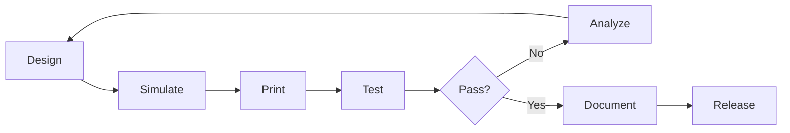

# 3D Prototyping Lab Project

> **Design and manufacture custom robotic components using CAD and additive manufacturing**

## Project Overview

The 3D Prototyping Lab project teaches you to design, iterate, and manufacture custom robot parts. From simple brackets to complex mechanisms, you'll master the complete prototyping pipeline using CAD software and 3D printing technology.

## Learning Objectives

- Master parametric CAD design
- Understand 3D printing technologies
- Optimize designs for manufacturing
- Select appropriate materials
- Iterate based on testing
- Document designs professionally

## Required Tools

### Software
- **CAD Software**: Fusion 360 (free) or FreeCAD
- **Slicing Software**: PrusaSlicer or Cura
- **Analysis Tools**: FEA in CAD, MeshLab
- **Version Control**: Git for CAD files

### Hardware
- **3D Printer**: FDM printer (minimum 200x200mm)
- **Calipers**: Digital preferred
- **Basic Tools**: Files, sandpaper, knife
- **Materials**: PLA, PETG, TPU filaments

## Core Projects

### Project 1: Custom Gripper Design

Design a task-specific gripper for the SO-101 arm.

#### Requirements
- Grasp objects 20-80mm diameter
- Payload: 500g minimum
- Servo actuated
- Modular fingers

#### Design Process
1. **Analysis**: Study object properties
2. **Concept**: Sketch initial designs
3. **CAD Model**: Create parametric model
4. **Simulation**: Test stress points
5. **Prototype**: Print and test
6. **Iterate**: Refine based on results

#### CAD Example (Fusion 360)
```python
# Parametric gripper design
finger_length = 80  # mm
finger_width = 20   # mm
servo_mount = 25    # mm
grip_angle = 45     # degrees

# Create base
base = create_box(100, 60, 20)

# Add servo mount
mount = create_cylinder(servo_mount/2, 30)
base = base.union(mount)

# Create fingers (parametric)
for i in range(2):
    finger = create_finger(finger_length, finger_width)
    finger = rotate(finger, grip_angle * i)
    base = base.union(finger)
```

### Project 2: Modular Joint System

Create a universal joint system for rapid prototyping.

#### Specifications
- Standard interface sizes
- Quick-connect mechanism
- Support 1kg load
- 180° rotation range
- Minimal backlash

#### Components
```
Joint Assembly
├── Housing (upper)
├── Housing (lower)
├── Bearing races
├── Servo mount
├── Cable guides
└── Snap-fit connectors
```

### Project 3: Robot Enclosure

Design a protective enclosure for electronics.

#### Features
- Ventilation for cooling
- Cable management
- Easy access panels
- Mounting points
- EMI shielding considerations

## Design Guidelines

### Design for 3D Printing

#### Layer Orientation
```
Strong direction: ═══════
Weak direction:  |||||||

Orient parts for maximum strength
in load-bearing direction
```

#### Support Minimization
- Design with 45° overhangs maximum
- Use bridging for spans less than 10mm
- Add chamfers to reduce supports
- Consider print orientation early

#### Tolerances
| Feature | Clearance | Press Fit |
|---------|-----------|-----------|
| Holes | +0.2mm | -0.1mm |
| Shafts | -0.2mm | +0.1mm |
| Threads | +0.4mm | N/A |

### Material Selection

#### PLA (Polylactic Acid)
- **Pros**: Easy to print, biodegradable
- **Cons**: Low temperature resistance
- **Use**: Prototypes, non-structural parts

#### PETG (Polyethylene Terephthalate Glycol)
- **Pros**: Strong, chemical resistant
- **Cons**: Stringing, harder to print
- **Use**: Structural parts, outdoor use

#### TPU (Thermoplastic Polyurethane)
- **Pros**: Flexible, impact resistant
- **Cons**: Difficult to print
- **Use**: Grippers, dampers, seals

#### ASA/ABS
- **Pros**: Temperature resistant, strong
- **Cons**: Warping, fumes
- **Use**: Enclosures, high-temp parts

## Print Settings Optimization

### Quality vs Speed
```python
# Profile configurations
draft_profile = {
    'layer_height': 0.3,
    'infill': 20,
    'speed': 80,
    'time': '2 hours'
}

quality_profile = {
    'layer_height': 0.1,
    'infill': 40,
    'speed': 40,
    'time': '8 hours'
}
```

### Strength Optimization
- Increase wall thickness (3-4 perimeters)
- Higher infill (40-60%)
- Alternate infill patterns
- Optimize layer adhesion temperature

## Advanced Techniques

### Multi-Material Printing
```gcode
; Tool change script
T1 ; Select material 2
M104 S210 ; Set temperature
M109 ; Wait for temperature
; Continue printing
```

### Embedded Components
Design parts with embedded:
- Nuts and bolts
- Magnets
- Electronics
- Bearings

### Post-Processing
1. **Sanding**: Progressive grits 120-400
2. **Chemical**: Acetone vapor (ABS)
3. **Coating**: Primer and paint
4. **Assembly**: Threaded inserts

## Testing & Validation

### Mechanical Testing
```python
def stress_test(part, load_kg):
    """Test part under load"""
    initial_dimension = measure(part)
    apply_load(part, load_kg)
    final_dimension = measure(part)

    deformation = final_dimension - initial_dimension

    if deformation > tolerance:
        return "FAIL: Redesign needed"
    return "PASS"
```

### Fit Testing
- Print test pieces first
- Check critical dimensions
- Verify assembly sequence
- Test moving parts

## CAD Best Practices

### Parametric Design
```python
# Fusion 360 parameter example
parameters = {
    'shaft_diameter': 8,
    'bearing_od': 22,
    'wall_thickness': 3,
    'clearance': 0.2
}

# Use parameters in sketches
hole_diameter = parameters['shaft_diameter'] + parameters['clearance']
```

### Version Control
```bash
# Track CAD files with git
git init
git add *.f3d *.step *.stl
git commit -m "Initial gripper design v1.0"
git tag -a v1.0 -m "First prototype"
```

### Documentation
Include with each design:
- README with specifications
- Assembly instructions
- BOM (Bill of Materials)
- Print settings
- Test results

## Iteration Workflow



## Community Designs

### Design Library
Access community-contributed designs:
- Grippers and end-effectors
- Joint mechanisms
- Sensor mounts
- Tool holders
- Enclosures

### Remix Guidelines
When modifying existing designs:
1. Credit original designer
2. Document changes
3. Share improvements
4. Maintain compatibility

## Manufacturing Services

### When to Outsource
Consider professional manufacturing for:
- High-precision parts
- Metal components
- Large quantities
- Special materials

### Service Providers
- **3D Hubs**: Global network
- **Shapeways**: Various materials
- **JLCPCB**: PCBs and 3D printing
- **Local makerspaces**: Community access

## Safety Guidelines

### 3D Printer Safety
- Never leave printer unattended first layer
- Ensure proper ventilation
- Keep workspace clear
- Use appropriate temperatures
- Handle hot components carefully

### Material Handling
- Store filament properly (dry)
- Dispose of waste responsibly
- Use appropriate PPE
- Understand material properties

## Project Showcase

### Student Successes
- Biomimetic hand (Sarah K.)
- Omnidirectional wheel (Alex T.)
- Soft gripper (Jordan M.)
- Cable-driven joint (Pat L.)

### Innovation Highlights
- Patent-pending mechanisms
- Award-winning designs
- Industry adoptions
- Research publications

## Assessment Rubric

### Design Quality (40%)
- Functionality
- Elegance
- Parametric modeling
- Documentation

### Manufacturing (30%)
- Printability
- Material selection
- Post-processing
- Assembly ease

### Testing (20%)
- Performance metrics
- Durability
- Iteration improvements
- Failure analysis

### Presentation (10%)
- Documentation clarity
- Video demonstration
- Community sharing

## Resources

### Tutorials
- [CAD for 3D Printing](/tutorials/cad-printing)
- [Material Science](/tutorials/materials)
- [Design Optimization](/tutorials/optimization)

### Tools & Calculators
- Wall thickness calculator
- Support angle analyzer
- Cost estimation tool
- Strength calculator

### Community
- Discord: #3d-printing channel
- Monthly design challenges
- Print farm access
- Material exchange

## Getting Started

1. **Install Software**: Set up CAD and slicer
2. **Calibrate Printer**: Level bed, tune settings
3. **First Print**: Calibration cube
4. **Join Community**: Share your setup
5. **Start Designing**: Begin with simple parts

## Next Steps

After mastering basics:
1. **Advanced CAD**: Surfacing, simulation
2. **Multi-material**: Experiment with composites
3. **Other Processes**: SLA, CNC, laser cutting
4. **Production**: Design for manufacturing
5. **Business**: Start design service

---

Ready to create? [Start with CAD basics →](/tutorials/cad-basics)